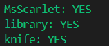
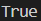
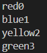
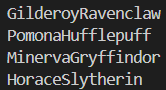

**Overview:**
This repository showcases a collection of logical reasoning exercises, demonstrating how knowledge representation and automated reasoning can be applied to various domains. The suite consists of five main components, each tackling a unique problem.

### 1. **Clue.py**
#### **Knowledge Representation:**
* **Symbols:** Characters, Rooms, Weapons
* **Logical Operations:** `Or` (at least one character, room, and weapon), `Not` (exclusions), `And` (cumulative knowledge)
* **Objective:** Deduce possible culprits, rooms, and weapons based on given clues.

#### **Output Screenshot:**

#### **Example Explanation:**
The knowledge base is constructed by asserting the existence of at least one character, room, and weapon (`Or`), then progressively adding exclusions (`Not`) and new information (`And`), allowing the system to deduce possibilities.

### 2. **Harry.py**
#### **Knowledge Representation:**
* **Symbols:** Weather (`rain`), Characters (`hagrid`, `dumbledore`)
* **Logical Operations:** `Implication` (weather affects character presence), `Or` (character presence), `Not` (exclusions), `And` (cumulative knowledge)
* **Objective:** Determine if it's raining given the presence of characters.

#### **Output Screenshot:**

#### **Example Explanation:**
This demonstrates conditional reasoning using `Implication`, showing how the presence of characters can imply weather conditions, given additional constraints.

### 3. **Logic.py**
#### **Knowledge Representation:**
* **Base Class:** `Sentence`
* **Derived Classes:** `Symbol`, `Not`, `And`, `Or`, `Implication`, `Biconditional`
* **Objective:** Provide a foundational framework for logical operations and sentence construction.

#### **Explanation:**
This file establishes the core classes for constructing logical sentences and evaluating them. It serves as the backbone for all other components, enabling the creation of complex knowledge bases.

### 4. **Mastermind.py**
#### **Knowledge Representation:**
* **Symbols:** Colors with Positions (`colorX`)
* **Logical Operations:** `Or` (each color has a position), `Implication` (exclusivity constraints), `And` (cumulative knowledge)
* **Objective:** Solve a Mastermind-like puzzle by deducing color positions.

#### **Output Screenshot:**

#### **Example Explanation:**
This showcases how logical constraints can be used to solve puzzles, utilizing `Or` for initial possibilities, `Implication` for exclusivity, and `And` for integrating clues.

### 5. **Puzzle.py**
#### **Knowledge Representation:**
* **Symbols:** People and Houses (`personHouse`)
* **Logical Operations:** `Or` (each person in a house), `Implication` (exclusivity), `And` (cumulative knowledge)
* **Objective:** Assign people to houses based on given constraints.

#### **Output Screenshot:**

#### **Example Explanation:**
Similar to Mastermind, but applied to a different domain, highlighting the versatility of logical knowledge representation in solving assignment puzzles.

**Running the Project:**
1. Clone the repository.
2. Ensure Python is installed.
3. Run each `.py` file individually to observe the outputs.
